# SpringBoot 와 Spring Security 연동

✔️ 학습할 내용
- 스프링 시큐리티에서 제공하는 로그인 처리 방식의 이해
- JPA 와 연동하는 커스텀 로그인 처리
- Thymeleaf 에서 로그인 정보 활용하기


- 스프링 시큐리티 객체들을 처리하기 위한 Thymeleaf 확장 플로그인 추가

```groovy
dependencies {
    implementation 'org.springframework.boot:spring-boot-starter-data-jpa'
    implementation 'org.springframework.boot:spring-boot-starter-security'
    implementation 'org.springframework.boot:spring-boot-starter-thymeleaf'
    implementation 'org.springframework.boot:spring-boot-starter-web'
    implementation 'org.thymeleaf.extras:thymeleaf-extras-springsecurity5'
    compileOnly 'org.projectlombok:lombok'
    developmentOnly 'org.springframework.boot:spring-boot-devtools'
    annotationProcessor 'org.projectlombok:lombok'
    providedRuntime 'org.springframework.boot:spring-boot-starter-tomcat'
    testImplementation 'org.springframework.boot:spring-boot-starter-test'
    testImplementation 'org.springframework.security:spring-security-test'
    
    implementation group: 'org.mariadb.jdbc', name: 'mariadb-java-client'
    implementation group: 'org.thymeleaf.extras', name: 'thymeleaf-extras-springsecurity5'
    implementation group: 'org.thymeleaf.extras', name: 'thymeleaf-extras-java8time'
}
```

- 기타 설정 추가

데이터베이스, JPA 관련 설정과 파일 업로드 관련 설정 추가, 시큐리티와 관련된 로그 레벨 낮게 설정해서 자세한 로그 확인할 수 있게 설정

```properties
spring.datasource.driver-class-name=org.mariadb.jdbc.Driver
spring.datasource.url=jdbc:mariadb://localhost:3306/bootex
spring.datasource.username=bootuser
spring.datasource.password=bootuser

spring.jpa.hibernate.ddl-auto=update
spring.jpa.properties.hibernate.format_sql=true
spring.jpa.show-sql=true

spring.thymeleaf.cache=false

spring.servlet.multipart.enabled=true
spring.servlet.multipart.location=C:\\upload
spring.servlet.multipart.max-request-size=30MB
spring.servlet.multipart.max-file-size=10MB

logging.level.org.springframework.security.web=trace
logging.level.org.example=debug
```

- 실행

```shell
17:48:47.839 [Thread-0] DEBUG org.springframework.boot.devtools.restart.classloader.RestartClassLoader - Created RestartClassLoader org.springframework.boot.devtools.restart.classloader.RestartClassLoader@2271d2cb

  .   ____          _            __ _ _
 /\\ / ___'_ __ _ _(_)_ __  __ _ \ \ \ \
( ( )\___ | '_ | '_| | '_ \/ _` | \ \ \ \
 \\/  ___)| |_)| | | | | || (_| |  ) ) ) )
  '  |____| .__|_| |_|_| |_\__, | / / / /
 =========|_|==============|___/=/_/_/_/
 :: Spring Boot ::                (v2.7.3)

2022-09-08 17:48:48.542  INFO 4160 --- [  restartedMain] c.e.s.SpringSecurityApplication          : Starting SpringSecurityApplication using Java 17.0.2 on KunYoung with PID 4160 (C:\Users\ur2ku\OneDrive\바탕 화면\WORKSPACE\[Spring]workspace\SpringSecurity\build\classes\java\main started by ur2ku in C:\Users\ur2ku\OneDrive\바탕 화면\WORKSPACE\[Spring]workspace\SpringSecurity)
2022-09-08 17:48:48.544  INFO 4160 --- [  restartedMain] c.e.s.SpringSecurityApplication          : No active profile set, falling back to 1 default profile: "default"
2022-09-08 17:48:48.585  INFO 4160 --- [  restartedMain] .e.DevToolsPropertyDefaultsPostProcessor : Devtools property defaults active! Set 'spring.devtools.add-properties' to 'false' to disable
2022-09-08 17:48:48.585  INFO 4160 --- [  restartedMain] .e.DevToolsPropertyDefaultsPostProcessor : For additional web related logging consider setting the 'logging.level.web' property to 'DEBUG'
2022-09-08 17:48:49.032  INFO 4160 --- [  restartedMain] .s.d.r.c.RepositoryConfigurationDelegate : Bootstrapping Spring Data JPA repositories in DEFAULT mode.
2022-09-08 17:48:49.043  INFO 4160 --- [  restartedMain] .s.d.r.c.RepositoryConfigurationDelegate : Finished Spring Data repository scanning in 4 ms. Found 0 JPA repository interfaces.
2022-09-08 17:48:49.484  INFO 4160 --- [  restartedMain] o.s.b.w.embedded.tomcat.TomcatWebServer  : Tomcat initialized with port(s): 8080 (http)
2022-09-08 17:48:49.492  INFO 4160 --- [  restartedMain] o.apache.catalina.core.StandardService   : Starting service [Tomcat]
2022-09-08 17:48:49.492  INFO 4160 --- [  restartedMain] org.apache.catalina.core.StandardEngine  : Starting Servlet engine: [Apache Tomcat/9.0.65]
2022-09-08 17:48:49.543  INFO 4160 --- [  restartedMain] o.a.c.c.C.[Tomcat].[localhost].[/]       : Initializing Spring embedded WebApplicationContext
2022-09-08 17:48:49.543  INFO 4160 --- [  restartedMain] w.s.c.ServletWebServerApplicationContext : Root WebApplicationContext: initialization completed in 958 ms
2022-09-08 17:48:49.670  INFO 4160 --- [  restartedMain] o.hibernate.jpa.internal.util.LogHelper  : HHH000204: Processing PersistenceUnitInfo [name: default]
2022-09-08 17:48:49.715  INFO 4160 --- [  restartedMain] org.hibernate.Version                    : HHH000412: Hibernate ORM core version 5.6.10.Final
2022-09-08 17:48:49.828  INFO 4160 --- [  restartedMain] o.hibernate.annotations.common.Version   : HCANN000001: Hibernate Commons Annotations {5.1.2.Final}
2022-09-08 17:48:49.906  INFO 4160 --- [  restartedMain] com.zaxxer.hikari.HikariDataSource       : HikariPool-1 - Starting...
2022-09-08 17:48:49.966  INFO 4160 --- [  restartedMain] com.zaxxer.hikari.HikariDataSource       : HikariPool-1 - Start completed.
2022-09-08 17:48:49.989  INFO 4160 --- [  restartedMain] org.hibernate.dialect.Dialect            : HHH000400: Using dialect: org.hibernate.dialect.MariaDB106Dialect
2022-09-08 17:48:50.229  INFO 4160 --- [  restartedMain] o.h.e.t.j.p.i.JtaPlatformInitiator       : HHH000490: Using JtaPlatform implementation: [org.hibernate.engine.transaction.jta.platform.internal.NoJtaPlatform]
2022-09-08 17:48:50.235  INFO 4160 --- [  restartedMain] j.LocalContainerEntityManagerFactoryBean : Initialized JPA EntityManagerFactory for persistence unit 'default'
2022-09-08 17:48:50.262  WARN 4160 --- [  restartedMain] JpaBaseConfiguration$JpaWebConfiguration : spring.jpa.open-in-view is enabled by default. Therefore, database queries may be performed during view rendering. Explicitly configure spring.jpa.open-in-view to disable this warning
2022-09-08 17:48:50.524  WARN 4160 --- [  restartedMain] .s.s.UserDetailsServiceAutoConfiguration : 

Using generated security password: 9a7fb52e-4c3a-4a73-82f3-7d15067e5cca

This generated password is for development use only. Your security configuration must be updated before running your application in production.

2022-09-08 17:48:50.595 DEBUG 4160 --- [  restartedMain] edFilterInvocationSecurityMetadataSource : Adding web access control expression [authenticated] for any request
2022-09-08 17:48:50.612 TRACE 4160 --- [  restartedMain] o.s.s.w.a.i.FilterSecurityInterceptor    : Validated configuration attributes
2022-09-08 17:48:50.612 TRACE 4160 --- [  restartedMain] o.s.s.w.a.i.FilterSecurityInterceptor    : Validated configuration attributes
2022-09-08 17:48:50.615  INFO 4160 --- [  restartedMain] o.s.s.web.DefaultSecurityFilterChain     : Will secure any request with [org.springframework.security.web.session.DisableEncodeUrlFilter@4cc47b75, org.springframework.security.web.context.request.async.WebAsyncManagerIntegrationFilter@37391e7b, org.springframework.security.web.context.SecurityContextPersistenceFilter@6cb9892a, org.springframework.security.web.header.HeaderWriterFilter@15b0ec06, org.springframework.security.web.csrf.CsrfFilter@1e5a0d82, org.springframework.security.web.authentication.logout.LogoutFilter@3e1da4fe, org.springframework.security.web.authentication.UsernamePasswordAuthenticationFilter@55c80996, org.springframework.security.web.authentication.ui.DefaultLoginPageGeneratingFilter@371888a0, org.springframework.security.web.authentication.ui.DefaultLogoutPageGeneratingFilter@2930a576, org.springframework.security.web.authentication.www.BasicAuthenticationFilter@57559a6c, org.springframework.security.web.savedrequest.RequestCacheAwareFilter@7cd98d0, org.springframework.security.web.servletapi.SecurityContextHolderAwareRequestFilter@68dabf46, org.springframework.security.web.authentication.AnonymousAuthenticationFilter@24f804c1, org.springframework.security.web.session.SessionManagementFilter@6c2d5330, org.springframework.security.web.access.ExceptionTranslationFilter@572d32b6, org.springframework.security.web.access.intercept.FilterSecurityInterceptor@3aea7a0e]
2022-09-08 17:48:50.646  INFO 4160 --- [  restartedMain] o.s.b.d.a.OptionalLiveReloadServer       : LiveReload server is running on port 35729
2022-09-08 17:48:50.674  INFO 4160 --- [  restartedMain] o.s.b.w.embedded.tomcat.TomcatWebServer  : Tomcat started on port(s): 8080 (http) with context path ''
2022-09-08 17:48:50.685  INFO 4160 --- [  restartedMain] c.e.s.SpringSecurityApplication          : Started SpringSecurityApplication in 2.827 seconds (JVM running for 3.659)
2022-09-08 17:49:06.249  INFO 4160 --- [ionShutdownHook] j.LocalContainerEntityManagerFactoryBean : Closing JPA EntityManagerFactory for persistence unit 'default'
2022-09-08 17:49:06.251  INFO 4160 --- [ionShutdownHook] com.zaxxer.hikari.HikariDataSource       : HikariPool-1 - Shutdown initiated...
2022-09-08 17:49:06.253  INFO 4160 --- [ionShutdownHook] com.zaxxer.hikari.HikariDataSource       : HikariPool-1 - Shutdown completed.

Process finished with exit code 130
```

<br/>

- 중간에 패스워드 하나가 출력되는 것을 볼 수 있음
```shell
Using generated security password: 9a7fb52e-4c3a-4a73-82f3-7d15067e5cca
```

생성된 패스워드는 기본으로 사용해 볼 수 있는 'user' 계정의 패스워드로 프로젝트 초기에 아무 계정도 없을 때 사용할 수 있는 임시 패스워드 역할을 함

<br/>

- http://localhost:8080/login 의 경로로 접근해서 로그인 테스트

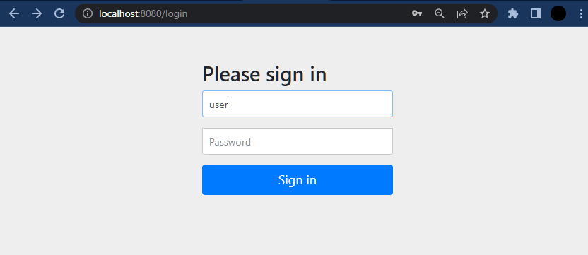


<br/>

## ⭐   시큐리티 설정 클래스 설정

스프링 부트는 자동 설정 기능이 있어 별도의 설정 없이도 연동 처리는 위와 같이 가능하지만 스프링 시큐리티를 이용하는 모든 프로젝트는 프로젝트에 맞는 
설정을 추가하는 것이 일반적임. 따라서 별도의 시큐리티 설정 클래스를 만들어보자

- SecurityConfig 클래스 추가

```java
import lombok.extern.log4j.Log4j2;
import org.springframework.context.annotation.Configuration;
import org.springframework.security.config.annotation.web.configuration.EnableWebSecurity;

@Configuration
@Log4j2
@EnableWebSecurity
public class SecurityConfig {}
```

원래는 WebSecurityConfigurerAdapter 를 상속받고 오버라이드를 통해서 설정을 조정했는데 deprecate 되고 @EnableWebSecurity 사용.

| 키워드                  | 내용                            |
|:---------------------|:------------------------------|
| SecurityConfig.class | 앞으로 모든 시큐리티 관련 설정은 여기다 추가할 것임 |

<br/>

## ⭐  확인을 위한 SampleController

<br/>

- SampleController  

```java
import lombok.extern.log4j.Log4j2;
import org.springframework.stereotype.Controller;
import org.springframework.web.bind.annotation.GetMapping;
import org.springframework.web.bind.annotation.RequestMapping;

@Controller
@Log4j2
@RequestMapping("/sample/")
public class SampleController {

    @GetMapping("/all")
    public void exAll() {
        log.info("exAll........");
    }

    @GetMapping("/member")
    public void exMember() {
        log.info("exMember.......");
    }

    @GetMapping("/admin")
    public void exAdmin() {
        log.info("exAdmin.......");
    }

}
```

SampleController 에는 현재 사용자의 권한에 따라 접근할 수 있는 경로를 지정할 것임

> - 로그인을 하지 않은 사용자도 접근할 수 있는 '/sample/all'
> - 로그인한 사용자만이 접근할 수 있는 '/sample/member'
> - 관리자 (admin) 권한이 있는 사용자만이 접근할 수 있는 '/sample/admin'


<br/>

- [테스트용 파일 추가 ]()

```html
<!DOCTYPE html>
<html lang="en">
<head>
	<meta charset="UTF-8">
	<title>admin</title>
</head>
<body>
	<h2>admin</h2>
</body>
</html>
```

```html
<!DOCTYPE html>
<html lang="en">
<head>
	<meta charset="UTF-8">
	<title>all</title>
</head>
<body>

	<h2>all</h2>

</body>
</html>
```

```html
<!DOCTYPE html>
<html lang="en">
<head>
	<meta charset="UTF-8">
	<title>member</title>
</head>
<body>

	<h2>member</h2>

</body>
</html>
```

---

<br/>
<br/>
<br/>

## ⭐  스프링 시큐리티 용어와 흐름

프로젝트를 실행하고 '/sample/all' 과 같은 경로를 호출하면 시큐리티로 인해 로그인 화면이 보이는 것을 확인할 수 있음.
이를 서버 로그를 중심으로 살펴보자

로그인 세션이 없을 경우 'localhost:8080/sample/admin' 으로 접속하든 'localhost:8080/sample/all'으로 접속하든
'localhost:8080/sample/member' 로 접속하든 'http://localhost:8080/login' 페이지가 호출되는 것을 확인할 수 있다.

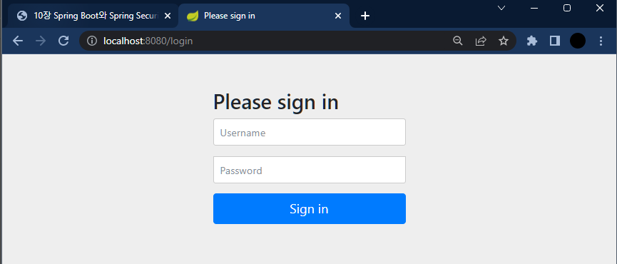

- '/sample/all' 등을 호출할 경우 내부적으로 여러 개의 필터 (filter)가 동작하는 것을 확인할 수 있음.
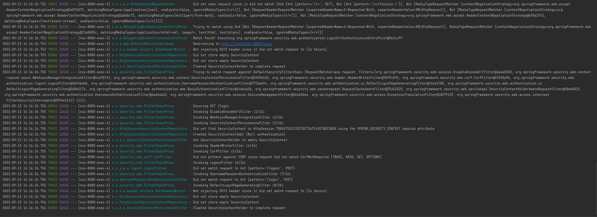

<br/>

- 스프링 시큐리티의 동작에는 여러 개의 객체가 서로 데이터를 주고 받으면서 이루어짐

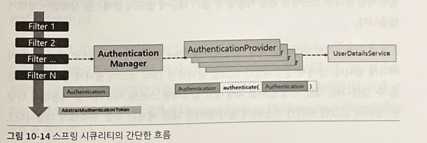

> 핵심 역할은 AuthenticationProvider (인증 매니저)를 통해서 이루어진다. AuthenticationProvider 는 인증 매니저가 어떻게 동작해야 하는지를 결정하고 최종적으로 실제 인증은 UserDetailService 에 의해서 이루어진다.

스프링 시큐리티의 가장 핵심 개념은 인증 (Authentication)과 인가 (Authorization) 이다. 예를 들어 은행에 금고가 하나 있고, 사용자가 금고의 내용을 열어 본다고 가정해 보면 다음과 같은 과정을 거치게 된다.

> 1. 사용자는 은행에 가서 자신이 어떤 사람인지 자신의 신분증으로 증명한다.
> 2. 은행에서는 사용자의 신분을 확인한다.
> 3. 은행에서 사용자가 금고를 열어볼 수 있는 사람인지를 판단한다.
> 4. 만일 적절한 관리나 권한이 있는 사용자의 경우 금고를 열어준다.

위의 과정에서 1은 인증에 해당하는 작업으로 자신을 '증명'하는 것이다. 3에서는 사용자를 '인가'하는 일종의 허가를 해 주는 과정으로 스프링 시큐리티 역시 내부적으로 위와 유사한 과정을 거쳐서 동작한다.

<br/>

### ✔ 필터와 필터 체이닝

스프링 시큐리티에서 필터 (Filter)는 서블릿이나 JSP 에서 사용하는 필터와 같은 개념이지만, 스프링 시큐리티에서는 스프링의 빈과 연동할 수 있는 구조로 설계되어 있다.
일반적인 필터는 스프링의 빈을 사용할 수 없기 때문에 별도의 클래스를 상속받는 형태가 많다.

스프링 시큐리티의 내부에는 여러 개의 필터가 Filter Chain 이라는 구조로 Request 를 처리하게 된다. 앞에서 실행되었던 로그를 살펴보면 15개 정도의 필터가 동작하는 것을 확인할 수 있다.
개발 시에 필터를 확장하고 설정하면 스프링 시큐리티를 이용해서 다양한 형태의 로그인 처리가 가능하게 된다. 아래는 스프링 시큐리티 내부에 사용되는 주요 필터이다.

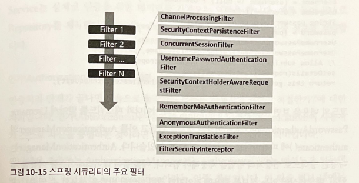


<br/>

### ✔  인증을 위한 AuthenticationManager

필터의 핵심적인 동작은 AuthenticationManager 를 통해서 인증 (Authentication) 이라는 타입의 객체로 작업을 하게 된다.
AuthenticationManager가 가진 인증 처리 메서드는 파라미터도 Authentication 타입으로 받고 리턴 타입 또한 Authentication 이다.

인증 (Authentication) 는 '주민등록증' 과 비슷한 개념으로 생각하면 된다. '인증' 이라는 용어는 '스스로 증명하다' 라는 의미이다. 예를 들어 로그인하는 과정에서는 사용자의 아이디/패스워드로 자신이 어떤 사람인지를 전달한다.
전달된 아이디/패스워드로 실제 사용자에 대해서 검증하는 행위는 AuthenticationManager (인증 매니저)를 통해서 이루어진다.

실제 동작에서 전달되는 파라미터는 UsernamePasswordAuthenticationToken 과 같이 토큰이라는 이름으로 전달된다. 즉, 스프링 시큐리티 필터의 주요 역할이 인증 관련된 정보를 토큰이라는 객체로 만들어 전달한다는 의미이다.
아래는 기본으로 제공되는 필터 중 UsernamePasswordAuthenticationFilter 클래스 코드 중 일부이다.

```
String username = obtainUsername(request);
username = (username != null) ? username : "";
username = username.trim();
String password = obtainPassword(request);
password = (password ! = null) ? password : "";
UsernamePasswordAuthenticationToken authRequest = new UsernamePasswordAuthenticationToken(username, password);
// Allow subckasses to set the "details" property
setDetails(request, authRequest);
return this.getAuthenticationManager().authenticate(authRequest);
```

request 를 이용해서 사용자의 아이디와 패스워드를 받아서 UsernamePasswordAuthenticationToken 이라는 객체를 만들고 
이를 AuthenticationManager 의 authenticate() 에 파라미터로 전달하는 것을 확인할 수 있음.
AuthenticationManager 는 이러한 처리를 AuthenticationProvider 로 처리한다.

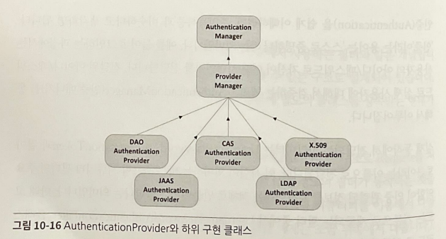


<br/>
<br/>

### ✔ 인가 (Authorization)와 권한/ 접근 제한
인증처리 단계 이후 사용자 권한을 확인하여 접근 제한을 둠. (Access-Control)
<br/>

- 📋 url 아무거나 입력

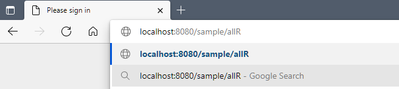

- 📋 스프링 시큐리티에서 인증/인가가 필요하다고 판단. 사용자가 인증하도록 로그인 화면으로 redirect


- 📋 임시 계정, 비번 입력

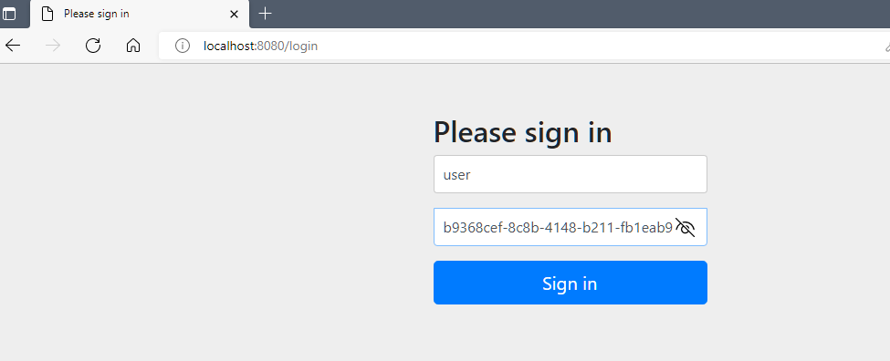

- 📋 정보가 전달되면 AuthenticationManager가 적절한 AuthenticationProvider를 찾아서 인증 시도

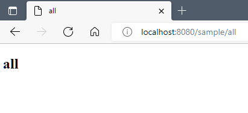

> AuthenticationProvider의 실제 동작은 UserDetailService를 구현한 객체로 처리

<br/>
<br/>

## ⭐  스프링 시큐리티 커스터마이징

### ✔ PasswordEncoder
패스워드를 인코딩하는 객체 (암호화)임. 스프링 시큐리티는 여러 종류의 PasswordEncoder를 제공하고 있으며 그 중 가장 많이 사용하는 것은 BCryptPasswordEncoder라는 클래스이다.

> - BCryptPasswordEncoder
> 'bcrypt'라는 해시 함수를 이용해 패스워드를 암호화함. 암호화된 패스워드는 복호화가 불가능하고 매번 암호화된 값도 다르게 됨.
> 대신 특정한 문자열이 암호화된 결과인지만을 확인할 수 있고 원본의 내용을 볼 수 없으므로 최근에 많이 사용됨. SecurityConfig는 @Bean을 통해 BCryptPasswordEncoder를 지정

<br/>

##### ✏ SecurityConfig
```java
package com.example.springsecurity.config;

import lombok.extern.log4j.Log4j2;
import org.springframework.context.annotation.Bean;
import org.springframework.context.annotation.Configuration;
import org.springframework.security.config.annotation.web.configuration.EnableWebSecurity;
import org.springframework.security.crypto.bcrypt.BCryptPasswordEncoder;
import org.springframework.security.crypto.password.PasswordEncoder;

@Configuration
@Log4j2
@EnableWebSecurity
public class SecurityConfig {

    @Bean
    PasswordEncoder passwordEncoder() {
        return new BCryptPasswordEncoder();
    }

}
```

<br/>

#### 📋 PasswordEncoder 테스트

```java
package com.example.springsecurity.security;

import org.junit.jupiter.api.Test;
import org.springframework.beans.factory.annotation.Autowired;
import org.springframework.boot.test.context.SpringBootTest;
import org.springframework.security.crypto.password.PasswordEncoder;

@SpringBootTest
public class PasswordTests {

    @Autowired
    private PasswordEncoder passwordEncoder;

    @Test
    public void testEncode() {

        String password = "1111";

        String enPw = passwordEncoder.encode(password);

        System.out.println("enPW: "+enPw);

        boolean matchResult = passwordEncoder.matches(password, enPw);

        System.out.println("matchResult: "+matchResult);

    }
}
```

<br/>

#### 📋 PasswordEncoder 테스트 결과

```shell
# first 테스트 결과
enPW: $2a$10$PHKK0aBGdOWborx8QJfJd.96.OfvKL47wUOuoFpuK2sr0/wzYfgw2
matchResult: true

# second 테스트 결과
enPW: $2a$10$pvtnrZLWPHqGZ/7xF5FxEO29x.UgF6lV21L16NtVfxuUtQzMQG9Nu
matchResult: true
```

<br/>
<br/>

### ✔ AuthenticationManager 설정
암호화된 패스워드를 이용하기 위한 사용자가 필요함.
이를 위해 AuthenticationManager의 설정을 쉽게 처리할 수 있도록 도와주는 Configure() 메서드 오버라이딩 처리

<br/>

#### 📋 SecurityConfig

```java
package com.example.springsecurity.config;

import lombok.extern.log4j.Log4j2;
import org.springframework.context.annotation.Bean;
import org.springframework.context.annotation.Configuration;
import org.springframework.security.config.annotation.authentication.builders.AuthenticationManagerBuilder;
import org.springframework.security.config.annotation.web.configuration.WebSecurityConfigurerAdapter;
import org.springframework.security.crypto.bcrypt.BCryptPasswordEncoder;
import org.springframework.security.crypto.password.PasswordEncoder;

@Configuration
@Log4j2
public class SecurityConfig extends WebSecurityConfigurerAdapter {

    @Bean
    PasswordEncoder passwordEncoder() {
        return new BCryptPasswordEncoder();
    }

    @Override
    protected void configure(AuthenticationManagerBuilder authenticationManagerBuilder) throws Exception {
        // 사용자 계정은 user1
        authenticationManagerBuilder.inMemoryAuthentication().withUser("user1")
                .password("$2a$10$pvtnrZLWPHqGZ/7xF5FxEO29x.UgF6lV21L16NtVfxuUtQzMQG9Nu") // 1111 패스워드 인코딩 결과
                .roles("USER");
    }

}
```

<br/>

#### 📋 PasswordEncoder 테스트

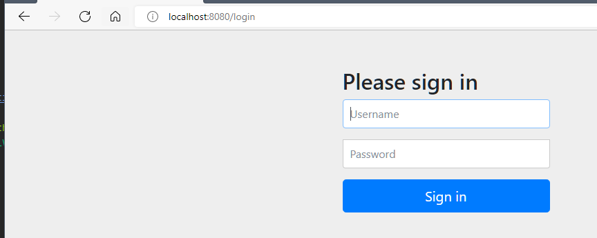

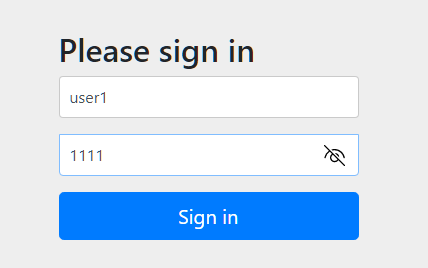

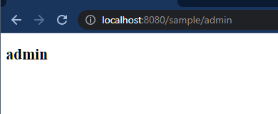

<br/>
<br/>
<br/>

### ✔ 인가(Authorization)가 필요한 리소스 설정

스프링 시큐리티를 이용한 특정 리소스 (웹의 경우에는 특정한 URL)에 접근 제한을 하는 방식에는 크개 2가지 있음.

> 1. 설정을 통해 패턴 지정
> 2. 어노테이션을 이용해 적용

<br/>

#### 📋 SecurityConfig

```java
import lombok.extern.log4j.Log4j2;
import org.springframework.context.annotation.Bean;
import org.springframework.context.annotation.Configuration;
import org.springframework.security.config.annotation.authentication.builders.AuthenticationManagerBuilder;
import org.springframework.security.config.annotation.web.builders.HttpSecurity;
import org.springframework.security.config.annotation.web.configuration.WebSecurityConfigurerAdapter;
import org.springframework.security.crypto.bcrypt.BCryptPasswordEncoder;
import org.springframework.security.crypto.password.PasswordEncoder;

@Configuration
@Log4j2
public class SecurityConfig extends WebSecurityConfigurerAdapter {

    @Bean
    PasswordEncoder passwordEncoder() {
        return new BCryptPasswordEncoder();
    }

    @Override
    protected void configure(HttpSecurity httpSecurity) throws Exception {

        httpSecurity.authorizeRequests()
                .antMatchers("/sample/all").permitAll();

    }

    @Override
    protected void configure(AuthenticationManagerBuilder authenticationManagerBuilder) throws Exception {
        // 사용자 계정은 user1
        authenticationManagerBuilder.inMemoryAuthentication().withUser("user1")
                .password("$2a$10$pvtnrZLWPHqGZ/7xF5FxEO29x.UgF6lV21L16NtVfxuUtQzMQG9Nu") // 1111 패스워드 인코딩 결과
                .roles("USER");
    }

}
```

| 키워드                              | 설명                                 |
|:---------------------------------|:-----------------------------------|
| httpSecurity.authorizeRequests() | 인증이 필요한 자원들을 설정한다                  |
| antMatchers()                    | '**/*'와 같은 엔트 스타일의 패턴으로 원하는 자원을 선택 |
| permitAll()                      | 모든 사용자에게 접근 허락                     |

> 따라서 '/sample/all' 는 로그인 없이도 접근 가능함

<br/>

#### 📋 결과

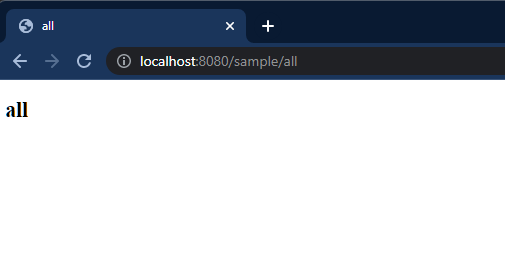

<br/>
<br/>

#### 📋 SecurityConfig

```java
import lombok.extern.log4j.Log4j2;
import org.springframework.context.annotation.Bean;
import org.springframework.context.annotation.Configuration;
import org.springframework.security.config.annotation.authentication.builders.AuthenticationManagerBuilder;
import org.springframework.security.config.annotation.web.builders.HttpSecurity;
import org.springframework.security.config.annotation.web.configuration.WebSecurityConfigurerAdapter;
import org.springframework.security.crypto.bcrypt.BCryptPasswordEncoder;
import org.springframework.security.crypto.password.PasswordEncoder;

@Configuration
@Log4j2
public class SecurityConfig extends WebSecurityConfigurerAdapter {

    @Bean
    PasswordEncoder passwordEncoder() {
        return new BCryptPasswordEncoder();
    }


    @Override
    protected void configure(HttpSecurity httpSecurity) throws Exception {
        /*TODO-ISSUE 모든 URL에서 Security 풀림*/
        httpSecurity.authorizeRequests()
                .antMatchers("/sample/all").permitAll()
                .antMatchers("/sample/member").hasRole("USER");

        httpSecurity.formLogin(); // 인가, 인증에 문제시 로그인 화면으로
    }

    @Override
    protected void configure(AuthenticationManagerBuilder authenticationManagerBuilder) throws Exception {
        // 사용자 계정은 user1
        authenticationManagerBuilder.inMemoryAuthentication().withUser("user1")
                .password("$2a$10$pvtnrZLWPHqGZ/7xF5FxEO29x.UgF6lV21L16NtVfxuUtQzMQG9Nu") // 1111 패스워드 인코딩 결과
                .roles("USER");
    }

}
```

|키워드|설명|
|:---|:---|
|httpSecurity.formLogin()|인가, 인증에 문제시 로그인 화면으로|

> formLogin()을 이욯아는 경우 별도의 디자인을 적용하기 위해 추가적인 설정이 필요하며 loginPage()나 loginProcessUrl(), defaultSuccessURL(), failureUrl() 등을 이용해서 필요한 설정을 지정할 수 있음.


<br/>

#### 📋 결과

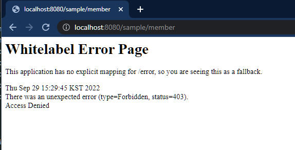


<br/>
<br/>
<br/>

### ✔ CSRF 설정 (Cross Site Request Forgery, 크로스 사이트 요청 위조)

CRSF란 서버에서 받아들이는 정보가 특별한 사전 조건을 검증하지 않는다는 점을 이용한 공격 방식이다. 
CSRF을 통해 단순 게시물의 조회수를 늘리는 등의 조작부터, 피해자의 계정을 이용한 다양한 공격이 가능하다.

예를 들어 A 사이트에는 특정 사용자 등급을 변경하는 URI가 존재하는 것을 공격자가 알았고 해당 URI에 약간의 파라미터가 필요하다는 것을 알았다고 가정하자.

> www.aaa.xxx?update? grade=admin&account=123

공격자는 A 사이트 관리자가 자주 방문하는 B사이트에  태그나 <form>를 이용하여 위의 URI를 추가한 게시물을 작성한다.

```html
<form action="www.aaa.xxx?update? grade=admin&account=123">
    <input type="submit" value="축 이벤트 당첨">
</form>

<!--or-->


```

A 사이트 관리자는 A사이트에 로그인된 상태로 자신이 평상시 방문하던 B 사이트를 방문하게 되고 공격자가 작성한 게시물을 보게되면 `` 태그 등에 사용된 URI가 호출되고 서버에는 로그인한 관리자의 요청에 의해 공격자는 admin 등급의 사용자로 변경됨.
이러한 문제는 서버에서 받아들이는 요청을 해석하고 처리할 때 어떤 출처에서 호출이 진행되었는지 따지지 않기 때문에 생기며, 하나의 사이트 내에서도 가능함.

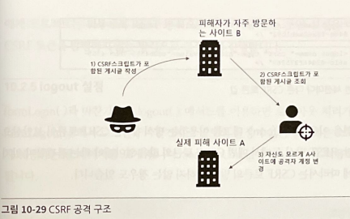

<br/>


#### 📋 현재 login form

```html
<html lang="en"><head>
    <meta charset="utf-8">
    <meta name="viewport" content="width=device-width, initial-scale=1, shrink-to-fit=no">
    <meta name="description" content="">
    <meta name="author" content="">
    <title>Please sign in</title>
    <link href="https://maxcdn.bootstrapcdn.com/bootstrap/4.0.0-beta/css/bootstrap.min.css" rel="stylesheet" integrity="sha384-/Y6pD6FV/Vv2HJnA6t+vslU6fwYXjCFtcEpHbNJ0lyAFsXTsjBbfaDjzALeQsN6M" crossorigin="anonymous">
    <link href="https://getbootstrap.com/docs/4.0/examples/signin/signin.css" rel="stylesheet" crossorigin="anonymous">
  </head>
  <body>
     <div class="container">
      <form class="form-signin" method="post" action="/login">
        <h2 class="form-signin-heading">Please sign in</h2>
        <p>
          <label for="username" class="sr-only">Username</label>
          <input type="text" id="username" name="username" class="form-control" placeholder="Username" required="" autofocus="">
        </p>
        <p>
          <label for="password" class="sr-only">Password</label>
          <input type="password" id="password" name="password" class="form-control" placeholder="Password" required="">
        </p>
        <input name="_csrf" type="hidden" value="6df225a0-163b-4e5f-8bb9-a6421bdd9e27">
        <button class="btn btn-lg btn-primary btn-block" type="submit">Sign in</button>
      </form>
</div>
</body></html>
```

현재 자동으로 만들어진 로그인 페이지에선 CSRF 토큰값이 발행된 것을 확인할 수 있음.
CSRF 토큰은 세션당 하나 생성된다.

일반적인 세션을 이용하고, `<form>` 태그를 이용하는 방식에는 CSRF 토큰이 보안상으로 권장되나, REST 방식 등에선 매번 CSRF 토큰 값을 알아내야 하는 불편함이 있기 때문에 경우에 따라서 CSRF 토큰의 발행을 하지 않는 경우도 있음.


<br/>
<br/>

### ✔ CSRF 토큰 비활성화

#### 📋 SecurityConfig

```java
import lombok.extern.log4j.Log4j2;
import org.springframework.context.annotation.Bean;
import org.springframework.context.annotation.Configuration;
import org.springframework.security.config.annotation.authentication.builders.AuthenticationManagerBuilder;
import org.springframework.security.config.annotation.web.builders.HttpSecurity;
import org.springframework.security.config.annotation.web.configuration.WebSecurityConfigurerAdapter;
import org.springframework.security.crypto.bcrypt.BCryptPasswordEncoder;
import org.springframework.security.crypto.password.PasswordEncoder;

@Configuration
@Log4j2
public class SecurityConfig extends WebSecurityConfigurerAdapter {

    @Bean
    PasswordEncoder passwordEncoder() {
        return new BCryptPasswordEncoder();
    }


    @Override
    protected void configure(HttpSecurity httpSecurity) throws Exception {
        httpSecurity.authorizeRequests()
                .antMatchers("/sample/all").permitAll()
                .antMatchers("/sample/member").hasRole("USER");

        httpSecurity.formLogin(); // 인가, 인증에 문제시 로그인 화면으로
        httpSecurity.csrf().disable();
    }

    @Override
    protected void configure(AuthenticationManagerBuilder authenticationManagerBuilder) throws Exception {
        // 사용자 계정은 user1
        authenticationManagerBuilder.inMemoryAuthentication().withUser("user1")
                .password("$2a$10$pvtnrZLWPHqGZ/7xF5FxEO29x.UgF6lV21L16NtVfxuUtQzMQG9Nu") // 1111 패스워드 인코딩 결과
                .roles("USER");
    }

}
```

|키워드|설명|
|:---|:---|
|httpSecurity.csrf().disable()|CSRF 토큰 비활성화|


<br/>

#### 📋 결과

```html
<html lang="en"><head>
    <meta charset="utf-8">
    <meta name="viewport" content="width=device-width, initial-scale=1, shrink-to-fit=no">
    <meta name="description" content="">
    <meta name="author" content="">
    <title>Please sign in</title>
    <link href="https://maxcdn.bootstrapcdn.com/bootstrap/4.0.0-beta/css/bootstrap.min.css" rel="stylesheet" integrity="sha384-/Y6pD6FV/Vv2HJnA6t+vslU6fwYXjCFtcEpHbNJ0lyAFsXTsjBbfaDjzALeQsN6M" crossorigin="anonymous">
    <link href="https://getbootstrap.com/docs/4.0/examples/signin/signin.css" rel="stylesheet" crossorigin="anonymous">
  </head>
  <body>
     <div class="container">
      <form class="form-signin" method="post" action="/login">
        <h2 class="form-signin-heading">Please sign in</h2>
        <p>
          <label for="username" class="sr-only">Username</label>
          <input type="text" id="username" name="username" class="form-control" placeholder="Username" required="" autofocus="">
        </p>
        <p>
          <label for="password" class="sr-only">Password</label>
          <input type="password" id="password" name="password" class="form-control" placeholder="Password" required="">
        </p>
        <button class="btn btn-lg btn-primary btn-block" type="submit">Sign in</button>
      </form>
</div>
</body></html>
```

<br/>
<br/>
<br/>

### ✔ logout 설정

#### 📋 SecurityConfig

```java
import lombok.extern.log4j.Log4j2;
import org.springframework.context.annotation.Bean;
import org.springframework.context.annotation.Configuration;
import org.springframework.security.config.annotation.authentication.builders.AuthenticationManagerBuilder;
import org.springframework.security.config.annotation.web.builders.HttpSecurity;
import org.springframework.security.config.annotation.web.configuration.WebSecurityConfigurerAdapter;
import org.springframework.security.crypto.bcrypt.BCryptPasswordEncoder;
import org.springframework.security.crypto.password.PasswordEncoder;

@Configuration
@Log4j2
public class SecurityConfig extends WebSecurityConfigurerAdapter {

    @Bean
    PasswordEncoder passwordEncoder() {
        return new BCryptPasswordEncoder();
    }

    @Override
    protected void configure(HttpSecurity httpSecurity) throws Exception {
        httpSecurity.authorizeRequests()
                .antMatchers("/sample/all").permitAll()
                .antMatchers("/sample/member").hasRole("USER");

        httpSecurity.formLogin(); // 인가, 인증에 문제시 로그인 화면으로
        httpSecurity.csrf().disable();
        httpSecurity.logout();
    }

    @Override
    protected void configure(AuthenticationManagerBuilder authenticationManagerBuilder) throws Exception {
        // 사용자 계정은 user1
        authenticationManagerBuilder.inMemoryAuthentication().withUser("user1")
                .password("$2a$10$pvtnrZLWPHqGZ/7xF5FxEO29x.UgF6lV21L16NtVfxuUtQzMQG9Nu") // 1111 패스워드 인코딩 결과
                .roles("USER");
    }

}
```

> 사용자가 별도의 로그아웃 관련 설정을 추가하고 싶다면 logoutURL(), logoutSuccessUrl() 등을 지정할 수 있음. <br/>
> 스프링 시큐리티는 HttpSession을 이용하는데 invalidatedHttpSession()과 deleteCookies()를 이용해서도 쿠키나 세션을 무효화 시킬 수 있다.


<br/>
<br/>
<br/>

### ✔ 프로젝트를 위한 JPA 처리

최근엔 아이디 대신 이메일을 아이디로 구성해서 회원 (ClubMember) 처리를 하는 경우가 많음. 회원 정보 구성은 다음과 같다.

> ##### 회원 (ClubMember)
> - 이메일(ID)
> - 패스워드
> - 이름 (닉네임)
> - 소셜 가입 여부 (OAuth로 회원 가입된 경우)
> - 기타 (등록일/수정일)

회원의 권한은 아래와 같이 두었다.

> ##### 권한 (ClubMemberRole)
> - USER: 일반 회원
> - MANAGER: 중간 관리 회원
> - ADMIN: 총괄 관리자

한 명의 클럽 회원은 여러 개의 권한을 가질 수 있다.

> ClubMember와 ClubMemberRole은 1:N 관계이나, 사실상 ClubMemberRole 자체는 핵심적인 역할을 하지 않기 때문에 별도의 엔티티 생성이 아닌 @ElementCollection 을 이용해 PK 없이 구성할 것임.


<br/>

#### 📋 BaseEntity

```java
package com.example.springsecurity.entity;

import lombok.Getter;
import org.springframework.data.annotation.CreatedDate;
import org.springframework.data.annotation.LastModifiedDate;
import org.springframework.data.jpa.domain.support.AuditingEntityListener;

import javax.persistence.Column;
import javax.persistence.EntityListeners;
import javax.persistence.MappedSuperclass;
import java.time.LocalDateTime;

@MappedSuperclass /*해당 어노테이션이 적용된 클래스는 테이블로 생성되지 않고 이 클래스를 상속받은 엔티티 클래스로 데이터베이스 테이블이 생성됨*/
@EntityListeners(value = {AuditingEntityListener.class}) /*엔티티 객체가 생성/변경되는 것을 감지 - AuditingEntityListener*/
@Getter
public class BaseEntity {

    @CreatedDate /*엔티티 생성 시간 처리*/
    @Column(name = "regdate", updatable = false)
    private LocalDateTime regDate;

    @LastModifiedDate /*최종 수정 시간 처리*/
    @Column(name = "moddate")
    private LocalDateTime modDate;

}
```


<br/>

#### 📋 SpringSecurityApplication

```java
import org.springframework.boot.SpringApplication;
import org.springframework.boot.autoconfigure.SpringBootApplication;
import org.springframework.data.jpa.repository.config.EnableJpaAuditing;

@SpringBootApplication
@EnableJpaAuditing
public class SpringSecurityApplication {
    public static void main(String[] args) {
        SpringApplication.run(SpringSecurityApplication.class, args);
    }
}
```


<br/>

#### 📋 ClubMemberRole

```java
package com.example.springsecurity.entity;

public enum ClubMemberRole {
    USER, MANAGER, ADMIN
}
```


<br/>

#### 📋 ClubMember

```java
package com.example.springsecurity.entity;

import lombok.*;

import javax.persistence.ElementCollection;
import javax.persistence.Entity;
import javax.persistence.FetchType;
import javax.persistence.Id;
import java.util.HashSet;
import java.util.Set;

@Entity
@Builder
@AllArgsConstructor
@NoArgsConstructor
@Getter
@ToString
public class ClubMember {

    @Id
    private String email;

    private String password;

    private String name;

    private boolean fromSocial;

    @ElementCollection(fetch = FetchType.LAZY)
    @Builder.Default
    private Set<ClubMemberRole> roleSet = new HashSet<>();
    public void addMemberRole(ClubMemberRole clubMemberRole) {
        roleSet.add(clubMemberRole);
    }

}
```

<br/>

#### 📋 결과


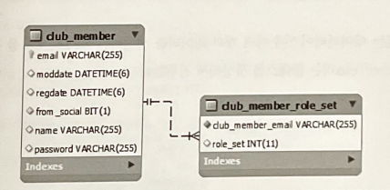

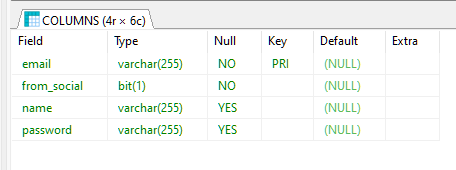

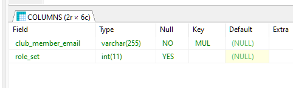


<br/>
<br/>
<br/>

### ✔ Repository와 더미데이터 추가하기

<br/>

#### 📋 ClubMemberRepository

```java
package com.example.springsecurity.repository;

import com.example.springsecurity.entity.ClubMember;
import org.springframework.data.jpa.repository.JpaRepository;

public interface ClubMemberRepository extends JpaRepository<ClubMember, String> {

}
```

<br/>

#### 📋 ClubMemberTests

```java
package com.example.springsecurity.security;

import com.example.springsecurity.entity.ClubMember;
import com.example.springsecurity.entity.ClubMemberRole;
import com.example.springsecurity.repository.ClubMemberRepository;
import org.junit.jupiter.api.Test;
import org.springframework.beans.factory.annotation.Autowired;
import org.springframework.boot.test.context.SpringBootTest;
import org.springframework.security.crypto.password.PasswordEncoder;

import java.util.stream.IntStream;

@SpringBootTest
public class ClubMemberTests {

    @Autowired
    private ClubMemberRepository repository;

    @Autowired
    private PasswordEncoder passwordEncoder;

    @Test
    public void insertDummies() {

        // 1 - 80 : USER
        // 81 - 90: USER, MANAGER
        // 91 - 100: USER, MANAGER, ADMIN

        IntStream.rangeClosed(1,100).forEach(i -> {
            ClubMember clubMember = ClubMember.builder()
                    .email("user"+i+"@outlook.com")
                    .name("사용자"+i)
                    .fromSocial(false)
                    .password(passwordEncoder.encode("1111"))
                    .build();

            // default role
            clubMember.addMemberRole(ClubMemberRole.USER);

            if(i > 80) clubMember.addMemberRole(ClubMemberRole.MANAGER);

            if(i > 90) clubMember.addMemberRole(ClubMemberRole.ADMIN);

            repository.save(clubMember);

        });

    }


}

```

<br/>

#### 📋 결과


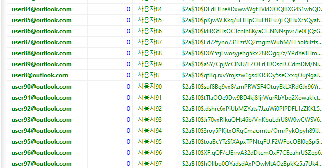

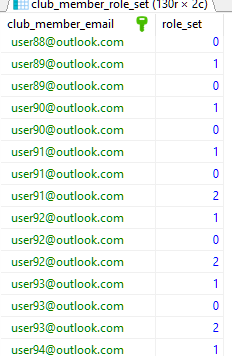


<br/>
<br/>
<br/>

### ✔ 회원 데이터 조회 테스트

> ClubMember의 조회 시엔 이메일을 기준으로 조회하고, 일반 로그인 사용자와 뒤에 추가되는 소셜 로그인 사용자를 구분하기 위해 ClubMemberRepository에 별도의 메서드로 처리

<br/>

#### 📋 ClubMemberRepository

```java
package com.example.springsecurity.repository;

import com.example.springsecurity.entity.ClubMember;
import org.springframework.data.jpa.repository.EntityGraph;
import org.springframework.data.jpa.repository.JpaRepository;
import org.springframework.data.jpa.repository.Query;
import org.springframework.data.repository.query.Param;

import java.util.Optional;

public interface ClubMemberRepository extends JpaRepository<ClubMember, String> {

    @EntityGraph(attributePaths = {"roleSet"}, type = EntityGraph.EntityGraphType.LOAD)
    @Query("select clubmember from ClubMember clubmember where clubmember.fromSocial = :social and clubmember.email =:email")
    Optional<ClubMember> findByEmail(@Param("email") String email, @Param("social") boolean social);

}
```

| 키워드 | 설명                      |
|:----|:------------------------|
|@EntityGraph| Lazy 로딩 사용할 때 한번에 패치할 때 |
|||

<br/>

#### 📋 ClubMemberTests

```java
package com.example.springsecurity.security;

import com.example.springsecurity.entity.ClubMember;
import com.example.springsecurity.entity.ClubMemberRole;
import com.example.springsecurity.repository.ClubMemberRepository;
import org.junit.jupiter.api.Test;
import org.springframework.beans.factory.annotation.Autowired;
import org.springframework.boot.test.context.SpringBootTest;
import org.springframework.security.crypto.password.PasswordEncoder;

import java.util.Optional;
import java.util.stream.IntStream;

@SpringBootTest
public class ClubMemberTests {

    @Autowired
    private ClubMemberRepository repository;

    @Autowired
    private PasswordEncoder passwordEncoder;


    @Test
    public void insertDummies() {

        // 1 - 80 : USER
        // 81 - 90: USER, MANAGER
        // 91 - 100: USER, MANAGER, ADMIN

        IntStream.rangeClosed(1,100).forEach(i -> {
            ClubMember clubMember = ClubMember.builder()
                    .email("user"+i+"@outlook.com")
                    .name("사용자"+i)
                    .fromSocial(false)
                    .password(passwordEncoder.encode("1111"))
                    .build();

            // default role
            clubMember.addMemberRole(ClubMemberRole.USER);

            if(i > 80) clubMember.addMemberRole(ClubMemberRole.MANAGER);

            if(i > 90) clubMember.addMemberRole(ClubMemberRole.ADMIN);

            repository.save(clubMember);

        });

    }


    @Test
    public void testRead() {

        Optional<ClubMember> result = repository.findByEmail("user95@outlook.com", false);

        ClubMember clubMember = result.get();

        System.out.println(clubMember);

    }


}

```


<br/>

#### 📋 결과

```
ClubMember(email=user95@outlook.com, password=$2a$10$toaBcYTzSfXApxTPNtqFU.F2WFocOBl0qSpGwouektXBwJI2GVH4O, name=사용자95, fromSocial=false, roleSet=[MANAGER, USER, ADMIN])
```


<br/>
<br/>
<br/>

### ✔ 시큐리티를 위한 UserDetailService

> 스프링 시큐리티가 ClubMemberRepository를 이용해서 회원 처리하는 부분 제작

기존의 로그인 처리 개발 방식 (회원 ID와 패스워드를 DB에서 조회하고, 올바른 데이터가 있따면 세션이나 쿠키로 처리)과 달리 스프링 시큐리티는 다음 방식으로 동작한다.

##### 🌴 스프링 시큐리티에션 회원이나 계정에 대해 User라는 용어를 사용. 따라서 User라는 단어 사용을 주의하자 (앞에서도 ClubMember라는 단어를 사용함)
##### 🌴 회원 ID 라는 용어 대신 username이라는 단어 사용. 스프링 시큐리티에선 username 단어 자체가 회원을 구별할 수 있는 식별 데이터를 의미함. 문자열로 처리하는 점은 같으나 일반적으로 사용하는 회원의 이름이 아닌 id에 해당함.
##### 🌴 username과 password를 동시에 사용하지 않는다. 스프링 시큐리티는 UserDetailService를 이용해 회원의 존재만을 우선적으로 가져오고 이후 password가 틀리면 'Bad Cridential (잘못된 자격증명)'이라는 결과를 만들어 냄 (인증)
##### 🌴 사용자의 username과 password로 인증 과정이 끝나면 원하는 자원 (URL)에 접근할 수 있는 적절한 권한이 있는지 확인하고 인가 과정을 실행함. 이 과정에선 'Access Denied'와 같은 결과가 만들어짐


